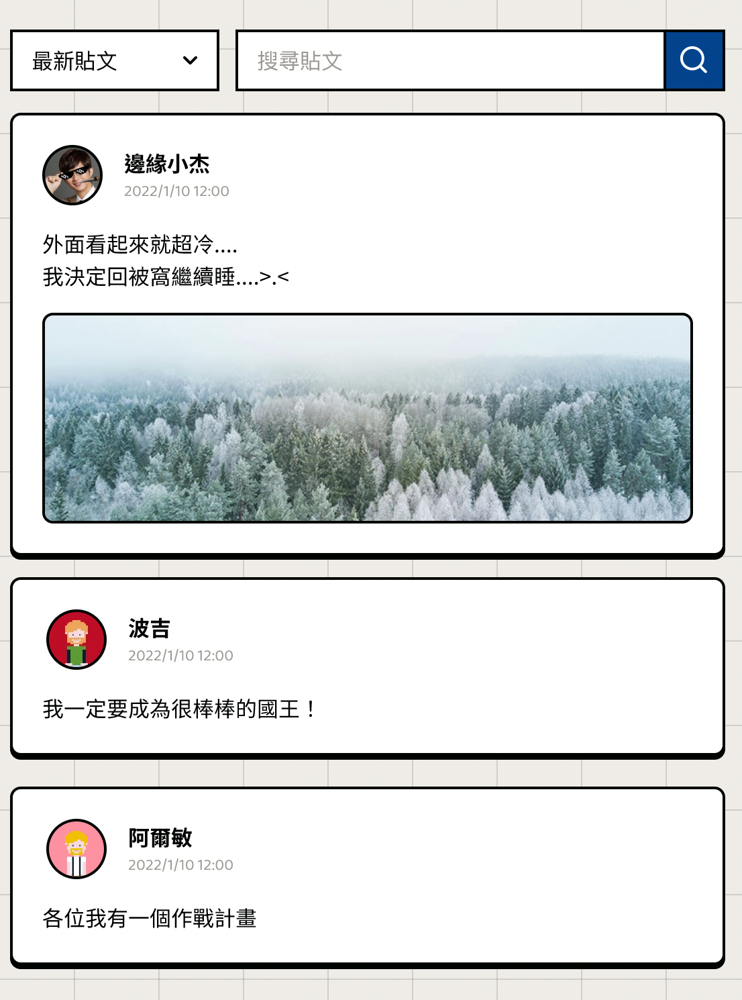
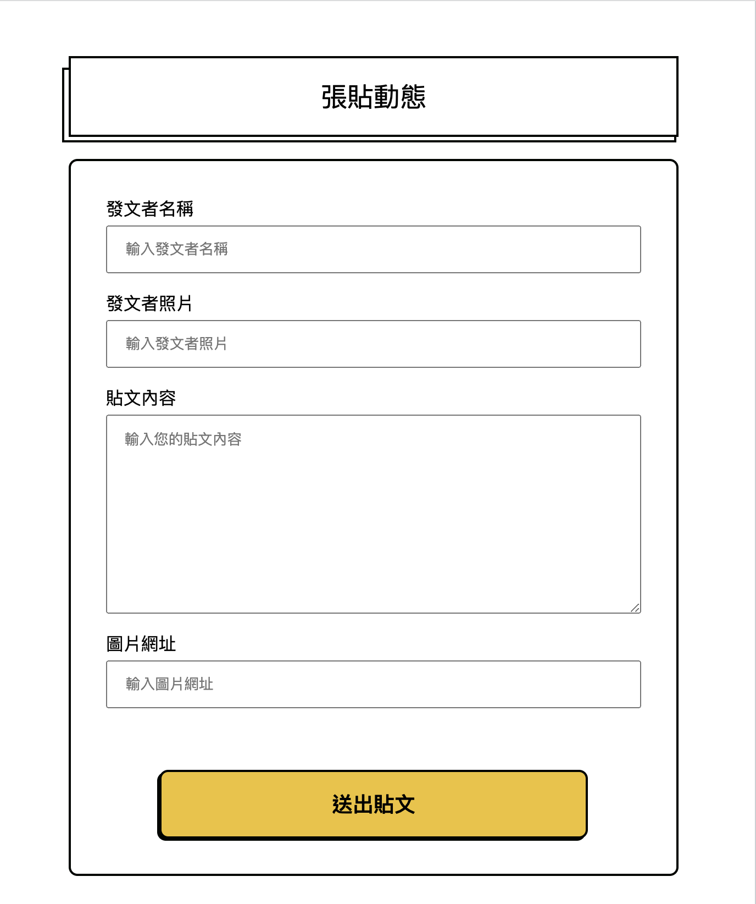

# Front_TeamWork_W2

### Developer 開發說明

兩種獲取後端 API 的方式

- 使用 heroku api
- 使用 Node.js + MongoDB 在本地端運行，請使用此 [後端 github](https://github.com/larrylinr5/week2TeamWork

```
在 js/http.js 做切換

/** 使用heroku api */
const http =

/** 使用Node.js + MongoDB 在本地端運行 */
//const http = 'http://127.0.0.1:3005/ArticleList'
```

### 功能一：取得貼文列表頁



### 功能二：新增貼文頁


